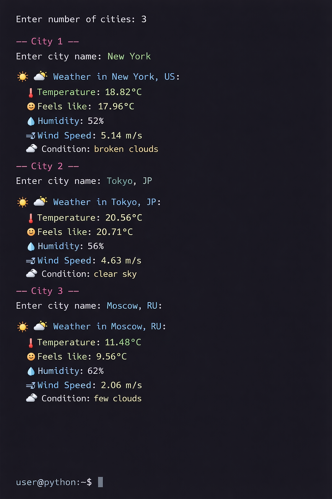

# 🌦️ Multi-City Weather App (Python)

A simple and interactive **command-line weather application** built with Python.
It allows users to fetch real-time weather data for multiple cities using the OpenWeatherMap API with a clean and colorful terminal output.

---

## 📸 Output Preview



---

## 🚀 Features

* 🌍 Get weather for multiple cities
* 🌡️ Temperature in Celsius
* 🤒 Feels like temperature
* 💧 Humidity level
* 🌬️ Wind speed
* ☁️ Weather condition
* 🎨 Colorful terminal output (using colorama)
* ⚠️ Error handling (invalid city, network issues)

---

## 🛠️ Technologies Used

* Python 🐍
* requests (API calls)
* colorama (colored output)
* OpenWeatherMap API

---

## 🔑 Setup Instructions

### 1. Clone this repository

```bash
git clone https://github.com/your-username/weather-app.git
```

### 2. Navigate to project folder

```bash
cd weather-app
```

### 3. Install dependencies

```bash
pip install requests colorama
```

### 4. Get your API key

Sign up at OpenWeatherMap and generate your API key.

### 5. Add API key in code

```python
API_KEY = "your_api_key_here"
```

### 6. Run the application

```bash
python main.py
```

---

## 📂 Project Structure

```
weather-app/
│── main.py
│── README.md
│── screenshot.png
```

---

## ⚠️ Important Note

* Do NOT share your API key publicly
* Use environment variables for better security

---

## 🌟 Future Improvements

* GUI version (Tkinter / PyQt)
* 5-day weather forecast
* Auto location detection
* Web version using Flask

---

## 👨‍💻 Author

Your Name

---

## ⭐ Support

If you like this project, give it a ⭐ on GitHub!
